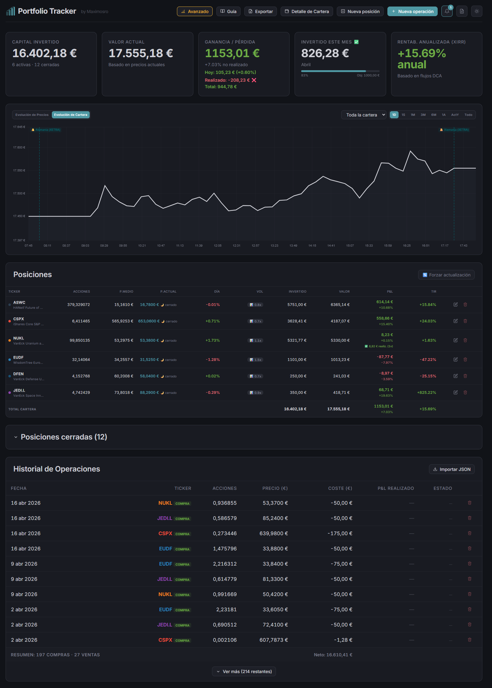

# 🌐 Cómo subir a GitLab Pages

## Opción A — Crear un repo nuevo en GitLab solo para la landing page

### 1. Crea un repositorio en GitLab

Ve a https://gitlab.com/projects/new y crea un repo nuevo, por ejemplo:
- Nombre: `portfolio-tracker` o `tu-usuario.gitlab.io` (si quieres que sea tu página principal)
- Visibilidad: Public

### 2. Sube los archivos

```bash
cd C:\ECLIPSE\WORKSPACE\Portfolio\MyPortFolioTracker

# Crea un directorio temporal para el repo de GitLab Pages
mkdir ..\PortfolioTrackerPage
cd ..\PortfolioTrackerPage

git init
git remote add origin https://gitlab.com/TU_USUARIO/portfolio-tracker.git

# Copia los archivos necesarios
mkdir public
copy ..\MyPortFolioTracker\docs\public\index.html public\
# Copia también las capturas cuando las tengas:
# mkdir public\screenshots
# copy capturas\*.png public\screenshots\

# Crea el .gitlab-ci.yml en la raíz
```

Crea un `.gitlab-ci.yml` en la raíz con este contenido:

```yaml
pages:
  stage: deploy
  script:
    - echo "Deploying to GitLab Pages"
  artifacts:
    paths:
      - public
  only:
    - main
```

```bash
git add .
git commit -m "Landing page Portfolio Tracker"
git branch -M main
git push -u origin main
```

### 3. Espera al despliegue

- Ve a tu repo en GitLab → **Deploy** → **Pages**
- En unos minutos estará disponible en: `https://TU_USUARIO.gitlab.io/portfolio-tracker/`

---

## Opción B — Añadir GitLab Pages al repo existente (migrar a GitLab)

Si prefieres tener todo el proyecto en GitLab:

### 1. Crea el repo en GitLab

### 2. Añade GitLab como remote

```bash
cd C:\ECLIPSE\WORKSPACE\Portfolio\MyPortFolioTracker
git remote add gitlab https://gitlab.com/TU_USUARIO/portfolio-tracker.git
git push gitlab master
```

### 3. El .gitlab-ci.yml ya está

El archivo `.gitlab-ci.yml` ya está creado en la raíz del proyecto.
GitLab lo detectará automáticamente y desplegará `docs/public/` como Pages.

La web estará en: `https://TU_USUARIO.gitlab.io/portfolio-tracker/`

---

## Opción C — Usar GitHub Pages (alternativa)

Si prefieres GitHub, es aún más fácil:

1. Crea un repo en GitHub
2. Sube el proyecto
3. Ve a **Settings** → **Pages** → Source: **Deploy from a branch** → Branch: `master` → Folder: `/docs`
4. Renombra `docs/public/` a `docs/` y listo

---

## 📸 No olvides las capturas

Antes de publicar, sustituye los placeholders del HTML por capturas reales:

1. Haz capturas de: dashboard, detalle de posición, simuladores, móvil
2. Guárdalas en `docs/public/screenshots/` (o `public/screenshots/`)
3. Edita el HTML sustituyendo los `<div class="screenshot-placeholder">` por ``

Ejemplo:
```html
<!-- Antes -->
<div class="screenshot-placeholder">📈 Dashboard principal</div>

<!-- Después -->

```

---

## 🔗 URL final

- GitLab: `https://TU_USUARIO.gitlab.io/portfolio-tracker/`
- GitHub: `https://TU_USUARIO.github.io/portfolio-tracker/`

